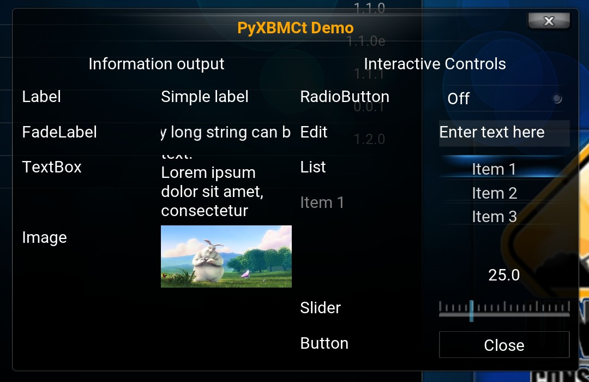

Controls
========

PyXBMCt provides 9 ready-to-use UI controls that are based on the respective :mod:`xbmcgui` controls
with the following differences:

* You don’t need to specify coordinates and size for the controls explicitly.
  The Grid layout manager takes care of control placement.
* All controls that require textures are provided with default textures
  (borrowed from Confluence and Estuary skin resources).
  You can specify your own textures for PyXBMCt controls, but you need to do this through keyword arguments (important!).
* Button caption is center-aligned by default. You can change button caption alignment by providing a necessary alignment
  parameter through a keyword argument (PyXBMCt already includes symbolic constants for control text alignment).
  Since all PyXBMCt Controls are subclassed from ``xbmcgui.Control*`` classes, you can use all parent :mod:`xbmcgui`
  classes' methods to set Control properties.

  **PyXBMCt controls (Confluence-based skin)**

.. figure:: _static/pyxbmct_controls_est.jpg

  **PyXBMCt controls (Estuary-based skin)**

Below is the list of PyXBMCt controls with brief descriptions:

Label
-----

:class:`Label<pyxbmct.addonwindow.Label>` implements a simple text label much like ``Tkinter.Label`` or ``QLabel``.

FadeLabel
---------

:class:`FaldeLabel<pyxbmct.addonwindow.FadeLabel>` is similar to :class:`Label<pyxbmct.addonwindow.Label>`,
but a very long text string is auto-scrolled.

TextBox
-------

:class:`TextBox<pyxbmct.addonwindow.TextBox>` shows multiline text. It can autoscroll very long text.

Image
-----

:class:`Image<pyxbmct.addonwindow.Image>` control displays images from files (``.jpg``, ``.png``, ``.gif``).
For ``.gif`` and ``.png`` images transparency is supported, and for ``.gif`` animation is shown as well.

Button
------

:class:`Button<pyxbmct.addonwindow.Button>` implements a clickable button. It generates a control event on click.

RadioButton
-----------

:class:`RadioButton<pyxbmct.addonwindow.RadioButton>` is a 2-state switch. It generates a control event on click.

Edit
----

:class:`Edit<pyxbmct.addonwindow.Edit>` implements a text entry field, similar to ``Tkinter.Entry`` or ``QLineEdit``.
When activated, it opens an on-screen keyboard to enter text.

List
----

:class:`List<pyxbmct.addonwindow.List>` implements a list of items.
The list scrolls when it cannot display all its items within available space.
It generates a control event when an item is selected.

Slider
------

:class:`Slider<pyxbmct.addonwindow.Slider>` is a control for stepless adjusting some value (e.g. volume level).
