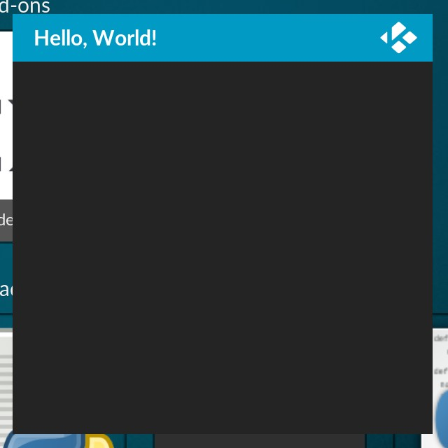
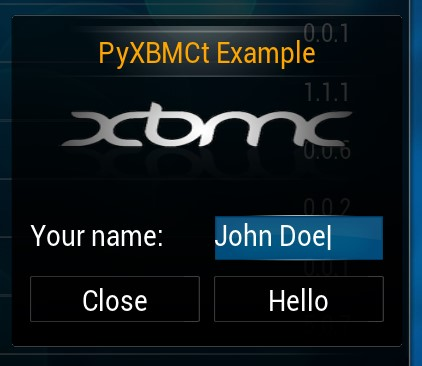
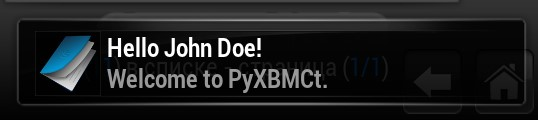

Code Examples
=============

Now let's take a look at some examples. As always, we'll start with "Hello, World!".

"Hello, World!" example
-----------------------

The simplest code which will display a window with "Hello, World!" header looks like this::

    # Import PyXBMCt module.
    import pyxbmct

    # Create a window instance.
    window = pyxbmct.AddonDialogWindow('Hello, World!')
    # Set window width, height and grid resolution.
    window.setGeometry(400, 400, 1, 1)
    # Show the created window.
    window.doModal()
    # Delete the window instance when it is no longer used.
    del window

If you've done everything correctly, you should see a window like the one shown below:

  **"Hello World!" example**

The window Grid has 1 row and 1 column. We haven't placed any controls on it, but ``setGeometry`` method takes
at least 4 arguments, so we have provided it dummy values.
Also for simplicity's sake we haven't used OOP in this example.

Now let's analyze a more complex example.

Example with interactive controls
---------------------------------

First, we need to draft the layout or our UI. You can use a pen and paper or imagine the layout in your head,
it does not matter. The following table showsh the draft of the UI layout for our example addon:

+----------------+----------------+----------------+
| Rows\\Columns  | 0              | 1              |
+----------------+----------------+----------------+
| 0              | Image                           |
+----------------+                                 |
| 1              |                                 |
+----------------+                                 |
| 2              |                                 |
+----------------+----------------+----------------+
| 3              | Name Label     | Name Edit      |
+----------------+----------------+----------------+
| 4              | "Close" button | "Hello" button |
+----------------+----------------+----------------+

As you can see, our example UI will have 4 rows, 2 columns and 5 controls placed in grid cells.
Let’s see how it looks in Python code::

    # Import necessary modules
    import xbmc
    import pyxbmct

    # Create a class for our UI
    class MyAddon(pyxbmct.AddonDialogWindow):

        def __init__(self, title=''):
            """Class constructor"""
            # Call the base class' constructor.
            super(MyAddon, self).__init__(title)
            # Set width, height and the grid parameters
            self.setGeometry(300, 280, 5, 2)
            # Call set controls method
            self.set_controls()
            # Call set navigation method.
            self.set_navigation()
            # Connect Backspace button to close our addon.
            self.connect(pyxbmct.ACTION_NAV_BACK, self.close)

        def set_controls(self):
            """Set up UI controls"""
            # Image control
            image = pyxbmct.Image('https://peach.blender.org/wp-content/uploads/poster_rodents_small.jpg?3016dc')
            self.placeControl(image, 0, 0, rowspan=3, columnspan=2)
            # Text label
            label = pyxbmct.Label('Your name:')
            self.placeControl(label, 3, 0)
            # Text edit control
            self.name_field = pyxbmct.Edit('')
            self.placeControl(self.name_field, 3, 1)
            # Close button
            self.close_button = pyxbmct.Button('Close')
            self.placeControl(self.close_button, 4, 0)
            # Connect close button
            self.connect(self.close_button, self.close)
            # Hello button.
            self.hello_buton = pyxbmct.Button('Hello')
            self.placeControl(self.hello_buton, 4, 1)
            # Connect Hello button.
            self.connect(self.hello_buton, lambda:
                xbmc.executebuiltin('Notification(Hello {0}!, Welcome to PyXBMCt.)'.format(
                    self.name_field.getText())))

        def set_navigation(self):
            """Set up keyboard/remote navigation between controls."""
            self.name_field.controlUp(self.hello_buton)
            self.name_field.controlDown(self.hello_buton)
            self.close_button.controlLeft(self.hello_buton)
            self.close_button.controlRight(self.hello_buton)
            self.hello_buton.setNavigation(self.name_field, self.name_field, self.close_button, self.close_button)
            # Set initial focus.
            self.setFocus(self.name_field)

    if __name__ == '__main__':
        myaddon = MyAddon('PyXBMCt Example')
        myaddon.doModal()
        del myaddon

This code should display the following window:

    **Our example UI**

If you enter your name (or any words for that matter) and click "Hello" button,
the addon will display a pop-up notification:

    **The pop-up notification**

Two remarks about the code:

- In my example I have used an online URL for the Image control.
  Paths to image files stored on your local disks can be used as well.
- Note the usage of :keyword:`lambda` to connect a function
  (:func:`xbmc.executebuiltin` in this case) with an argument.

Despite being rather simple, this example illustrates main steps of initializing PyXBMCt-based addon UI:

- Set up the geometry and grid of the main window.
- Place UI controls on the grid.
- Connect interactive controls and key actions to functions/methods.
- Set up keyboard/remote navigation between controls.
- Set initial focus on a control (necessary for navigation to work).

`PyXBMCt demo addon`_ povides more compherensive example on how to use all PyXBMCt Controls.

.. _PyXBMCt demo addon: https://github.com/romanvm/pyxbmct.demo
